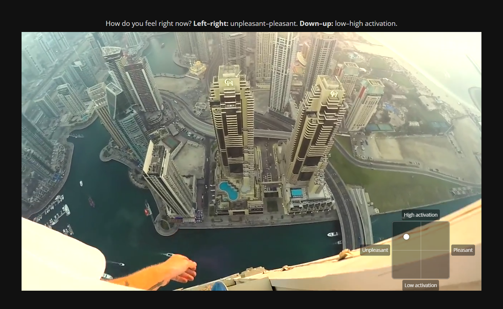

# online-affect-rating

A browser-based platform for **continuous, time-locked affect ratings while people watch a video**, run online
(jsPsych 8 on a JATOS server, recruited through Prolific). Participants move a dot within a small affect grid
(valence x arousal) or a 1D bar overlaid on the video; the position is sampled at 20 Hz against film time.

The platform was developed for a validation study of a first-person heights film (see
[heights-film-paper](https://github.com/embodied-computation-group/heights-film-paper) and the preregistration
[osf.io/s2yvb](https://osf.io/s2yvb)). That study is the worked example in this repository; tag
`v1.0-heights-film` is the exact code used to collect its data.

| 1D bar (`?dim=anxiety`) | 2D affect grid (`?dim=affect2d`) |
|---|---|
|  |  |

## What it does

- **Continuous rating** during the video: the mouse pointer is hidden and locked, so moving the mouse moves the
  bar or dot without clicking. Ratings are stored with the presented video frame time; leaving full screen or
  switching tabs pauses the video. Sessions resume after a page reload.
- **Practice** (target tracking; for the grid, placing example states) and **attention checks**.
- **Questionnaires** before and after the video (the example uses the STICSA somatic subscale) and free text.
- **Data quality checks** (`qc/`): per-session coverage, interruptions, rating bouts, and flags for scripted or
  automated input (mouse "teleporting", identical steps, untyped text).
- **Deployment helpers**: upload the task to JATOS and create Prolific draft studies from the command line.

## Layout

| folder | contents |
|---|---|
| `task/` | the jsPsych task. `js/config.js` (timing, video, completion links), `js/texts.js` (all participant-facing text), `js/experiment.js` (the session flow), and the two rating plugins |
| `scripts/` | local server, JATOS deployment, Prolific draft studies, video encoding |
| `prolific/` | example Prolific study settings and participant filters |
| `qc/` | download results (`review.py`), read raw files and compute QC measures (`qc_lib.py`), engagement check |
| `tests/` | end-to-end run-through in headless Chrome; synthetic check of the QC flags |
| `docs/` | [design](docs/design.md) of the example study, [raw data format](docs/data.md), [operations](docs/operations.md) |

## Quick start (local)

```bash
scripts/serve_local.sh      # serves the repository on http://localhost:8000
```

Put a video in `media/` (not included), set `localVideoUrl` (local) and `videoUrl` (on JATOS) in
`task/js/config.js`, and open
`http://localhost:8000/task/index.html?dim=affect2d&reset=1`. Automated run-through:
`python tests/e2e_local.py --dim affect2d` (needs Playwright). See [docs/operations.md](docs/operations.md) for
deployment to JATOS and Prolific; secrets go in a git-ignored `secrets.env` (template: `secrets.env.example`).

## Adapting it to your study

In this version the example study is built in. To run your own, change `task/js/texts.js` (information sheet,
consent, instructions, questions), `task/js/config.js` (video, timing, completion codes), the session flow in
`task/js/experiment.js`, the Prolific settings in `prolific/`, and the study identifiers at the top of
`qc/review.py` and `qc/qc_lib.py`. Making these settings configurable in one place is planned.

## Licence

Code: MIT (see `LICENSE`). The example film is a third-party video and is not included.
